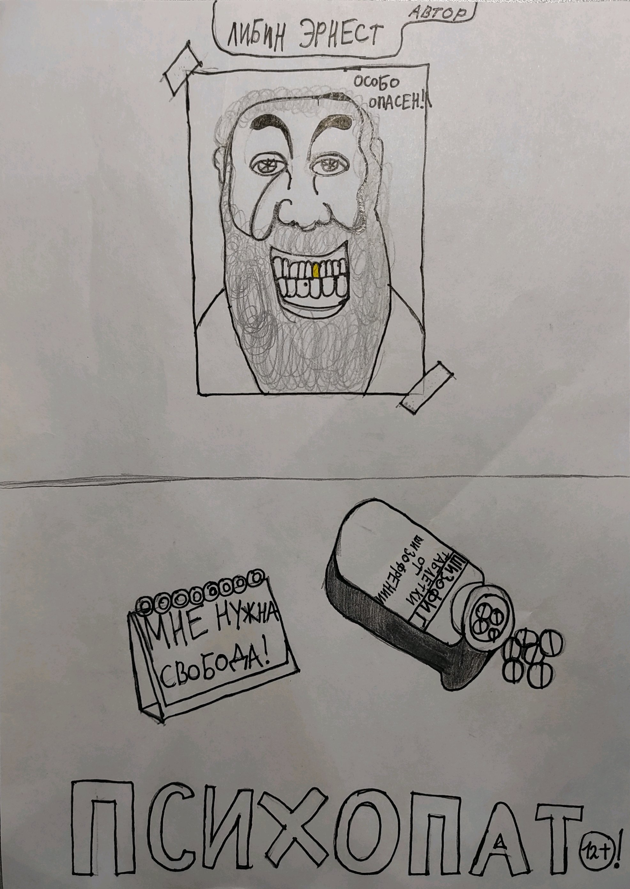

[TOC]

# Психопат
## 1 глава.
Одной больнице передали посылку от учёных в которой находились таблетки от шизофрении.  Ученые передали эти таблетки для их испытания на людях.  Врачи знали что обычный человек не согласится на этот эксперимент без вознаграждения.  А организовывать исследования на свои деньги им было жалко. Поэтому они решили пригласить на испытание таблеток — бездомных, вознаградив их палатой в которой они будут бесплатно жить и есть. Врачи решили для начала взять 10 участников.  Все кого они пригласили согласились, так как жить в палате намного лучше, чем на улице, где без денег выживать трудно. А тут за  какую-то таблетку предлагают и жильё и бесплатное питание. 

Всё шло хорошо им нужны были бездомные с первыми признаками шизофрении. К счастью врачей, многие жители улиц страдали вялотекущей формой шизофрении, хотя были ещё не опасными для общества. Лишь двух бездомных прогнали так как у них всё было хорошо. Все остальные выпили таблетки и легли спать. 

2 часа ночи. Все спят, но один бездомный проснулся, он вдруг начал слышать голоса которые шептали ему:

— видишь куда  тебя занесло? Разве такой жизни ты хотел? Не лучше ли снова выбраться на свободу? 

Бездомный сопротивлялся голосам и старался не слушать их но голосам всё-таки удалось его убедить сбежать из больницы

— хорошо — сказал Василий(так звали этого бездомного) — Что мне нужно сделать?

— Тебе мешают врачи...прошептали голоса — Завтра укради нож из столовки  и покончи со всеми кто решит встать у тебя на пути...

— Хорошо —  сказал Василий и уснул.
6 часов утра. Главврач будит всех в больнице и обьявляет что в 6:30 завтрак, так что им нужно поднимать свою задницу и вставать с кровати. Он добавил:

— А также перед завтраком обязательно нужно сделать зарядку и всем принять душ! На зарядку 15 минут и на душ 15 минут! Время тикает господа! Бегом!
Василий поднялся раньше всех и уже час назад украл нож из столовой, но он понимал что чтобы поменьше людей его заметило ему нужно дождаться ночи, поэтому он спрятал нож в свой карман в дырявых джинсах. После утренней зарядки Василий отошёл в туалет, но здесь снова появились голоса и Василий начал слушать что они говорят. Голоса ему шептали:

— Умница! Свобода скора встретиться с тобой! Ты видел глав.врача? Этот засранец ходит каждую ночь чтобы проверить все ли спят. Если он заметит твой побег, он поднимет тревогу. Избавься от него! Затащи его в место где нет людей и зарежь его!
После этого голоса ушли и Василий решил приняться за дело. Подойдя к главврачу, который был неподалеку от палаты бездомных, он попросил его вместе с ним пройти в мужской туалет. Они зашли, Василий закрыл дверь на защёлку. И не успел врач спросить в чём дело как Василий набросился на него. Когда нож был уже близко к шее врача, врач со всей дури пнул ногой по животу бездомного. Бездомный вырубился.
На следующий день. Время 15:00. Василий очнулся внутри скорой помощи, врачей рядом не было. Бездомный пытался пошевелиться, но он не мог.  Посмотрев вниз Василий увидел на себе смирительную рубашку. Бездомный не помнил что с ним случилось и почему он вырубился, но он помнил всё что шептали ему голоса. Он с яростью начал пытаться выбраться из смирительной рубашки. Ничего не получалось. Через несколько минут к нему подошёл  главврач которого он пытался убить. Но видимо раз он в смирительной рубашке идея не увенчалась успехом.

## 2 глава.
 Глав.врач сказал:

— Ты твою мать что творишь?!Совсем кукуха поехала?! Значит так, слушай меня сюда.   Сейчас тебя будут проверять на шизофрению и тебе не поздоровится если ты будешь шизофреником, хотя смотря на твои поступки ты уже давно им стал! Бездомный молчал, он не хотел разговаривать с главврачом.

— Молчишь? — спросил врач —  Ну молчи,молчи... и тихо под нос себе пробубнил: Псих!
 Через несколько часов скорая помощь приехала к психиатричесокй больнице. Василия поместили в белую комнату для наблюдения. На всякий случай смирительную рубашку снимать не стали.   Тест показал высокую степень шизофрении у бездомного. После теста Василия на несколько лет положили в палату для лечения.
Один из наблюдающих врачей в психиатрической больнице спросил у главного врача той больницы:

— Вы почему за ним не следите?!   Он у вас со стенами разговаривает, об стену бьётся, хорошо ещё что стены мягкие! Ставлю диагноз: опасное обострение шизофрении!

Михаил Васильевич, главный врач, ответил ему:

— Я знаю отчего у него могла развиться шизофрения...

— И отчего же?

— Мы тестировали таблетки от шизофрении, а у него таблетки сработали не так как надо..

— Ууух нам предстоит долгая работа Михаил Васильевич...

Тем временем в палате Василия. Василий лежал на кровати уже без смирительной рубашки и глядел в потолок. Но неожиданно у бездомного закружилась голова и он уснул. Проснувшись он очутился в лесу с кучей милых зверей. Их глаза блестели они были чудесны. На самом деле Василий выбрался из психушки когда спал. Он ходил во сне и ему мерещились какие-то существа. Он мог даже не заметить  как убил бы кого-то из людей. Теперь бездомный стал угрозой не только для себя.

## 3 глава
В однокомнатной квартире жил паренёк со своей девушкой. Паренька звали Дэн, а девушку Кристина.  Как то раз Дэн с Кристиной вышли на улицу, чтобы прогуляться в парке. В это время Василий выбежал из леса. Бездомный увидел издалека санитаров. Он испугался и спрятался в кусты. Дэн и Кристина шли спокойно, но вдруг санитары за спиной Дэна начали бежать за ними. Вскоре Дэн почувствовал сильный удар по его голове. Девушка увидев это пыталась ударить врачей, но санитары увезли Дэна. В растерянности Кристина села на землю и заплакала. Но вдруг из кустов вышел Василий который был очень похож на Дэна. Девушка увидев его радостно крикнула:

-Ты живой?! Дэни я так испугалась пойдём скорей домой от этих психов.
 Василий с удовольствием пошёл за девушкой. Бездомный подумал:
"Почему эта зелёная панда со стрекозинами крыльями со мной разговаривает?"

Кристина и Василий вернулись домой. Кристина спросила:

— Дэни дорогой ты голоден?

— Да стрекоза-панда...

— Ой видимо удар-то был слишком сильным, но ничего страшного. Завтра пойдём к врачу.

Услышав слово врач Василий начал прыгать, громко визжать и кричать:

— Не надо я собачка, я собачка.
Девушка была в шоке. Она не понимала что случилось с её парнем. Василий сказал:

— Зелёная панда со стрекозиными крыльями, я Василий, приятно познакомиться. А почему ты живёшь в зелёном мухоморе?

Кристина поняла что это точно не её парень. 

"Не мог же он настолько поменяться после удара", — подумала она. Девушка крикнула бездомному:

— Слышь ты, наркоман, где мой Дэни?
Василий молчал но смотрел на девушку со странной ухмылкой. Кристина в растерянности просто села на диван и зарыдала иногда говоря:

— Где мой парень? Где мой Дэни?

Тем временем Дэн проснулся в скорой помощи. Открыв глаза он сказал:

— чё-ё-ёрт голова просто раскалывается! Где я? Дэн посмотрел вниз увидев на себе смирительную рубашку он сказал:

— чё за нафиг? Что это такое? И где я вообще? После он крикнул:

— Ээй есть кто на корабле? Мне нужна помощь! К Дэну подошёл Михаил. Михаил сказал:

— Ну здравствуй буйный. Давно не виделись...

## 4 глава
Тем временем к Василию вернулись голоса. Они шептали ему:
 
— Избавься от этой плаксы!
 
Василий как под гипнозом пошёл на кухню, взял нож и направился к Кристине. Когда девушка это увидела она в беспокойстве говорила:

— Ты что задумал, наркоман? Отойди от меня, вонючий бомжара. Брысь! Брысь отсюда! Пошёл во... — но не успела девушка договорить, как острый нож вонзился в её шею. Бездомный начал жутко смеяться. Этот смех был настолько громким что его услышали соседи рядом с квартирой Дэна и Кристины. Чтобы вы понимали насколько близко были соседи, Кристина и Дэн жили в 123 квартире, а соседи услышавшие смех жили в 124 квартире. Смех был долгим и сильно раздражал соседей. Вскоре они решили пойти к квартире Кристины и Дэна. Они постучались. Никто не открыл. Они постучались второй раз. Тишина. Когда они постучались в третий раз им открыл абсолютно обезумевший, не перестающий хохотать Василий. Соседи испугались, но решили зайти в квартиру, а Василий их пропустил. Зайдя внутрь они увидели труп Кристины. Увидев это соседи бросились звонить в полицию. К счастью Василий забыл закрыть дверь. Они выбежали, зашли в свою квартиру и тут же заперлись. Василий лишь успел обозвать их скотинами и придурками. Василий был довольно глупым поэтому даже не подумал о том чтобы скрыться с места преступления или хотя бы закрыть дверь. Через несколько минут приехала полиция. Увидев Василия сидящим рядом с трупом полиция немедленно задержала бездомного. Все отпечатки на ноже и на трупе показали что это был Василий. И бездомный угодил в тюрьму. 

Тем временем в скорой помощи:

— Ну здравствуй, буйный. — сказал Михаил.

— Где... где я?- спросил Дэн. Почему у меня так башка болит? — спросил Дэн

— Это от биты. Если будешь снова пытаться сбежать, удары будут сильней. — пригрозил врач

— О... о чём вы говорите?

— Ты прекрасно знаешь о чём я говорю.

— Кто вы? Почему я здесь? Вы меня похитили! Вот выберусь в полицию позвоню!-сказал Дэн

— Никуда ты не позвонишь. Можешь поспать, а то мы нескоро прибудем!

— Куда... куда прибудем?-спросил Дэн

— Узнаешь!  Всё, отбой!!! — крикнул Михаил

— Но я не хочу спать...

— Я тебе помогу.-и после этих слов Дэн почувствовал удар битой но намного сильней чем в прошлый раз.

Очнувшись Дэн не сразу понял где он. Это была белая мягкая комната. И дверь закрытая на 4 замка. Над дверью висела картина с грустным клоуном а также слева, рядом с дверью была приклеена дурацкая листовка:

"Родина-дурка зовёт"

Похоже, развлекался кто-то из санитаров

Дэн встал. На нём не было смирительной рубашки. Он понял что ключи от замков могут быть где-то в этой комнате. Осмотрев всю комнату с пола до потолка, он не нашёл ничего. Дэн решил просто смотреть на картину с клоуном и просто потихоньку сходить с ума.  Тем временем в полицейском участке:

— Серёг, слышь помнишь того преступника Василия. — спросил полицейский

— Какого?-спросил второй.

— Ну этого бомжа полоумного.

— А, помню, помню. И чё?

— Короче, я на улице объявление видел. Это, короч, буйный из психушки.

— Ну и?

— Если мы его в психушку вернём вознаграждение получим. Халявные бабки, балбес!

— О, так это зашибись. Только у нас даже номера этой больницы нет.

Первый полицейский достал из кармана бумажку с объявлением о розыске Василия. Он сказал:

— Как это нет? Вот же!

— А, ну тогда давай звонить.

После звонка врачи решили пойти вместе с Василием в полицейский участок. Прибыв, они не поверили своим глазам. Дэн был сильно похож на Василия. Поэтому на них обоих провели тест на шизофрению. Дэн оказался нормальным. Врачи принесли самые искренние извинения, мол вы похожи как две капли воды только вот этот бомжара — псих.
И Дэн поехал домой. И вроде бы всё, хороший конец, но приехав Дэн не увидел в квартире свою девушку. Он решил спросить соседей.

— О боже!- крикнула соседка.

— Чего стоишь?! Быстро закрывай! Это — тот убийца! —крикнул её муж по имени Даниил.

— О чём вы говорите? — спросил Дэн.

— Это ты убил Кристину, — плача сказала соседка.

— Чтооо?! Где она? Где моя девушка?!

— Она в морге давно уже! Мы ей решили похороны организовать. Они завтра, а ты в тюрьме должен быть! — сказал Даниил и запер дверь.

Дэн понял кто убил её девушку.

"Это тот вонючий бомжара, который капец как похож на меня!" — подумал Дэн.

На следующий день. Время 12:00. Дэн из кустов смотрит  на похороны своей девушки. Он понимает что если он покажется, люди вызовут полицию. Холодный дождь бьёт по его голове. Дэн заплакал. У него больше нет никого. Он нашёл себе девушку после смерти своих родителей. Теперь у него никого нет. Никто не слышал его плача из-за громкого дождя. Соседка Наташа произнесла:

— Она была хорошей соседкой. Никогда не шумела, любила гостей и у неё всегда можно было попросить соль. Её улыбка и длинные светлые волосы дарили мне радость каждый день. Надеюсь она попадёт в рай.

Наташа произнесла это и тут же заплакала. Другие люди а именно друзья Кристины, друзья Наташи и Даниила и другие произнесли свои речи. После похорон Дэн вернулся в свою квартиру и хотел просто умереть, чтобы жить вместе с Кристиной на небе. Он взвесил все за и против и решил умереть, но когда он взял нож с кухни он понял что ему нужно делать, и с горящими глазами выбежал из квартиры сжимая нож. В больнице:  Врач вошел в кабинет поблизости от входной двери и сказал обеспокоенным голосом:

— Михаил Васильевич, там какой-то псих с ножом дверь входную выламывает.

— Так чего ты стоишь? Бегом за верёвками и успокоительным.

— Хорошо!

Дэн выбил входную дверь. Его тут же повязали на месте и вкололи успокоительное. Дэн очнулся в палате. Врачи связали его пока он спал. Когда же он проснулся, его вежливо спросили:

— Ты твою мать, скотина что творишь? Совсем кукуха поехала?

— Я просто забыл нож дома оставить, а прибежал потому что хочу помочь вам окончательно доработать "Шизофиг".-ответил Дэн.

— А, это тебя мы в прошлый раз по ошибке забирали, точно, — сказал Михаил Васильевич... Понятно. Ну тогда тебе для этого нужно учиться! Проведите-ка ему, на всякий случай, тест на шизофрению... И если все хорошо, выдайте новому практиканту халат! И Дэн начал учиться. Он устроился на работу в больницу и учился и работал, чиобы стать учёным, экспериментировать и создавать разные лекарства.

## 5 глава
Василий ехал в скорой помощи в больницу. Перед этим учёные усовершенствовали "шизофиг"(таблетки от шизофрении). К Василию подошли врачи. Они заставили его выпить 2 таблетки "шизофига". А также ему дали успокоительное, после которого Василий тут же заснул. Прошло 2 недели. Василию давали усовершенствованный "шизофиг" и ему становилось всё лучше и лучше. Прошла ещё неделя. Сегодня бездомного выписывают. Он полностью излечился. После выписки исчезли голоса и ему перестали мерещиться разные странные существа. Бездомный вышел на улицу, вдохнул воздуха и сказал:

— С голосами было прикольней. Ну и пофиг, пойду драться за объедки c другими бомжами.

И Василий так и продолжил бомжевать, но стал безопасен для себя и других.

Конец.